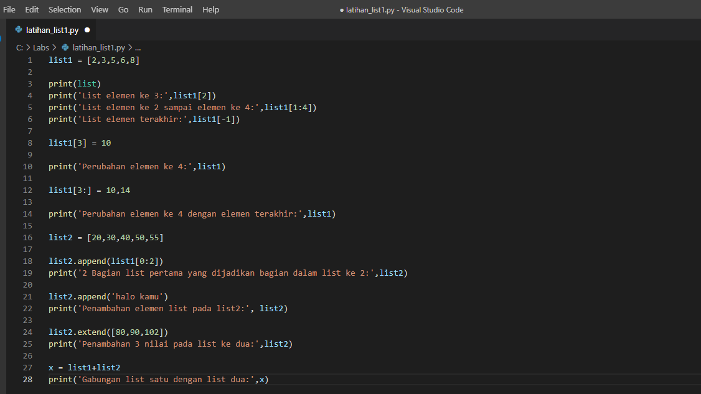
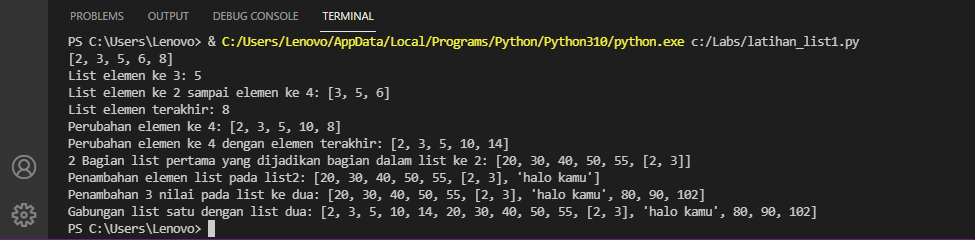
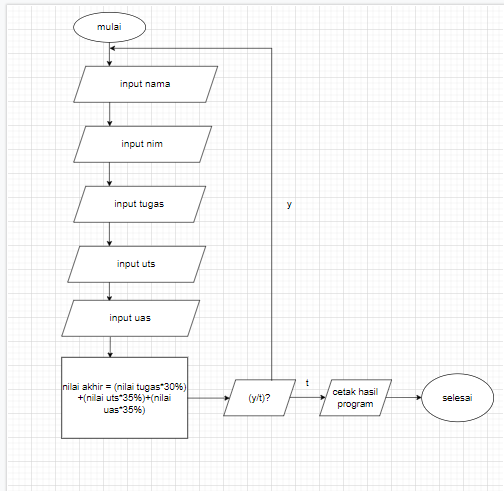
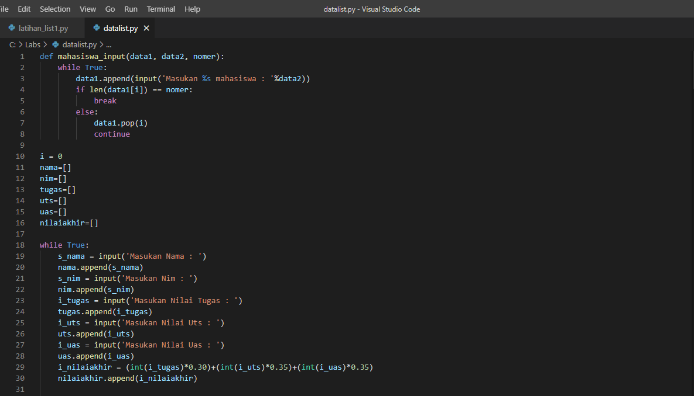
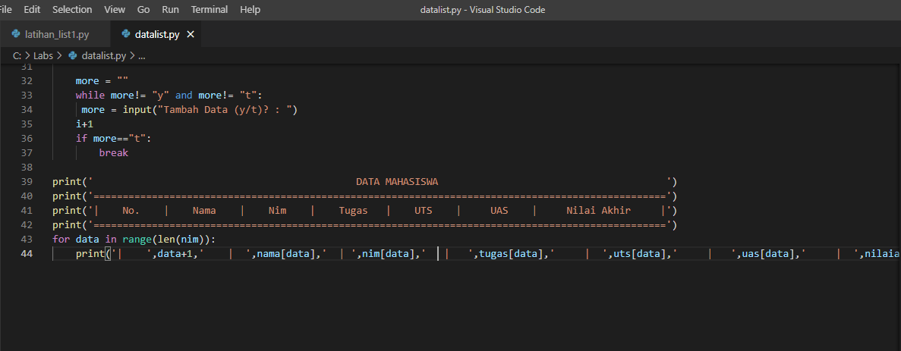
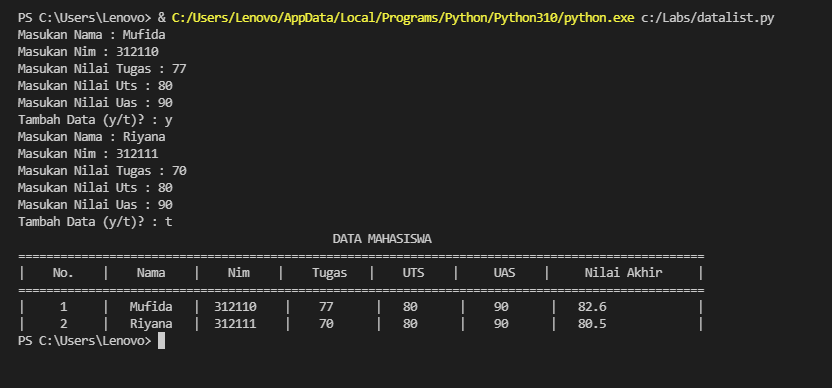

# modul4

## Latihan 1

### Mengakses, Mengubah, Mengakses List
Berikut adalah penjelasan dan gambar dalam mengakses, mengubah serta menambah list.

#### Mengakses List
1. list1=[2,3,5,6,8] adalah untuk mengisi elemen pada list 
2. print(list) pada perintah tersebut untuk menampilkaan elemen list.
3. print('list elemen ke 3:',list1[2]) perintah ini untuk menampilkan elemen ke 3 pada elemen list yang sudah dibuat. Pada [2] ini adalah untuk menampilkan angka 5 karna angka 5 terdapat pada index 2.
4. print('List elemen ke 2 sampai elemen ke 4:',list1[1:4]) perintah ini untuk menampilkan elemen ke 2 sampai ke 4 yaitu angka 3,5,6. 
5. print('List elemen terakhir:',list1[-1]) perintah ini untuk menampikan elemen terakhir yaitu angka 8, maka digunakan [-1] untuk mengambil elemen terakhir.

#### Mengubah List
1. list1[3] = 10, pada perintah ini untuk mengubah elemen ke 4 yang ada pada index 3 yang awalnya elemen ke 4 itu angka 6 dan berubah menjadi angka 10.
2. list1[3:] = 10,14. Pada perintah ini untuk mengubah elemen ke 4 sampai elemen terakhir, yang awalnya angka tersebut adalah 10,8 menjadi 10,14.

#### Menambah list 
1. list2 = [20,30,40,50,55]. Mengisi elemen pada list 
2. list2.append(list1[0:2]). Untuk mengambil 2 nilai list pada list pertama menggunakan perintah append.
3. list2.append('halo kamu'), pada perintah ini untuk menambah list dengan nilai string.
4. x = list1+list2, pada perintah ini untuk menggabungkan list1 dengan list2.
#### Berikut adalah tampilan program

## Pratikum 4

### Data Mahasiswa

#### Berikut adalah Flowcharct program

#### Berikut adalah gambar progamnya

1. def mahasiswa_input(data1, data2, nomer):
    while True:
        data1.append(input('Masukan %s mahasiswa : '%data2))
        if len(data1[i]) == nomer:
            break
        else:
            data1.pop(i)
            continue                                                                                                                           
Perintah di atas adalah memasukan data pada dictionory, untuk data1.pop(i) jika kita salah memasukan data maka data kita otomatis terhapus jika tidak sesuai dengan kriteria.
2. i = 0, memasukan variabel declaration.
3.  nama=[]
nim=[]
tugas=[]
uts=[]
uas=[]
nilaiakhir=[]                                                                                                                                  
Memasukan dictionory kosong, perintah di atas adalah untuk mendefinisikan listnya.
4. while True:
    s_nama = input('Masukan Nama : ')
    nama.append(s_nama)
    s_nim = input('Masukan Nim : ')
    nim.append(s_nim)
    i_tugas = input('Masukan Nilai Tugas : ')
    tugas.append(i_tugas)
    i_uts = input('Masukan Nilai Uts : ')
    uts.append(i_uts)
    i_uas = input('Masukan Nilai Uas : ')
    uas.append(i_uas)                                                                                                                          
Perintah di atas adalah code untuk menginput list, dan untuk perintah append menambahkan list jika sudah menginput satu nama atau nilai dalam list dan menggunakan perintah pengulangan while.
5. i_nilaiakhir = (int(i_tugas)*0.30)+(int(i_uts)*0.35)+(int(i_uas)*0.35)
    nilaiakhir.append(i_nilaiakhir)                                                                                                             
Untuk perintah di atas adalah menghitung nilai akhir dengan nilai tugas 30%, uts 35%, dan uas 35% karna presentasenya masih dalam bentuk persen maka diubah terlebih dahulu ke dalam bentuk desimal dimana tugas menjadi 0,30, uts menjadi 0,35, dan uas menjadi 0,35. Dan untuk append pada nilai akhir untuk menambahkan list dari yang di inputkan.
6.  more = ""
    while more!= "y" and more!= "t":
     more = input("Tambah Data (y/t)? : ")
    i+1
    if more=="t":
        break                                                                                                                                  
Perintah diatas untuk menginput data lagi, jika ingin menginput data lagi maka memilih "y" kalau tidak berati memilih "t".
7. print('                                             DATA MAHASISWA                                       ')
print('==================================================================================================')
print('|    No.    |    Nama    |    Nim    |    Tugas   |    UTS    |     UAS    |     Nilai Akhir     |')
print('==================================================================================================')
Perintah diatas adalah untuk membuat border saat menampilkan data agar terlihat rapih.
8. for data in range(len(nim)):
    print('|    ',data+1,'    |  ',nama[data],'  | ',nim[data],'   |   ',tugas[data],'     |  ',uts[data],'     |   ',uas[data],'     |  ',nilaiakhir[data],'            |')                                                                                                           
Perintah diatas adalah untuk menampilkan hasil dari list yang telah di inputkan, dengan menggunakan perulangan for data in range sedangkan (len(nim)) untuk mengembalikan panjang (jumlah anggota) dari suatu objek.
9. Berikut adalah gambar tampilan program.
